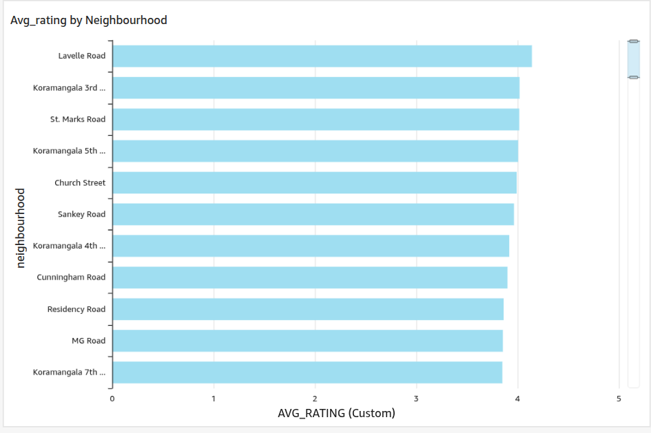
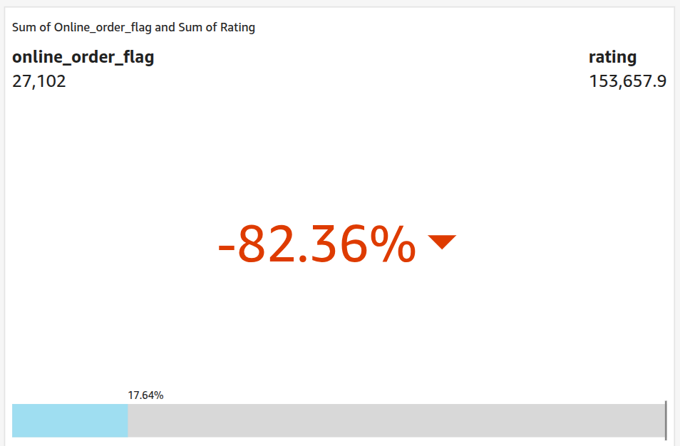
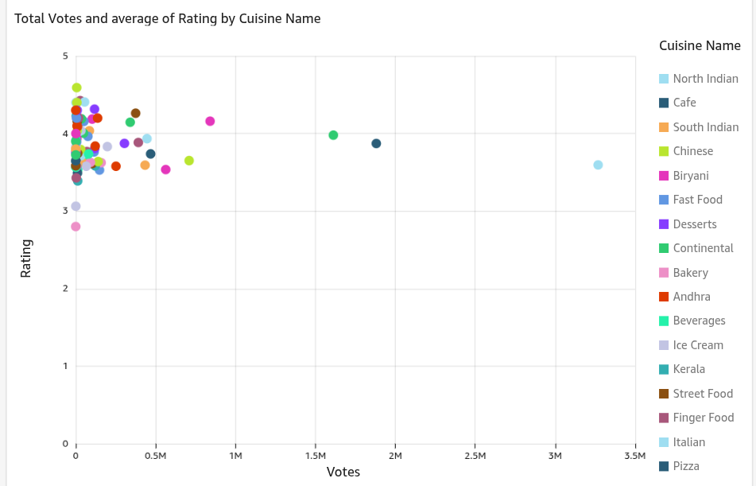
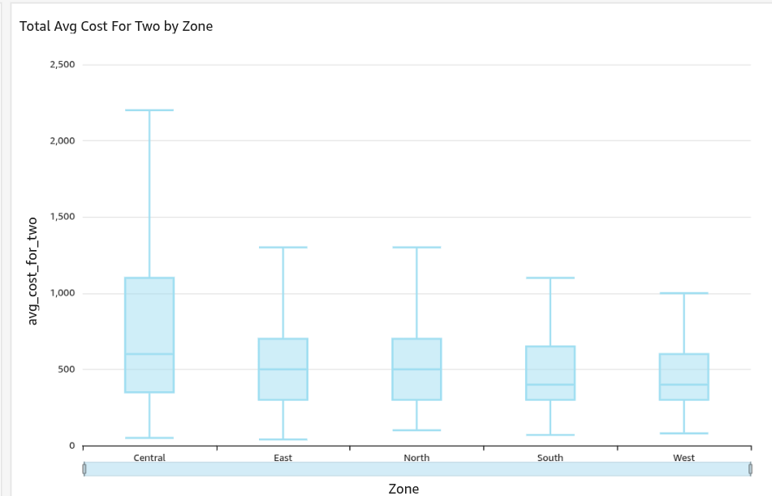
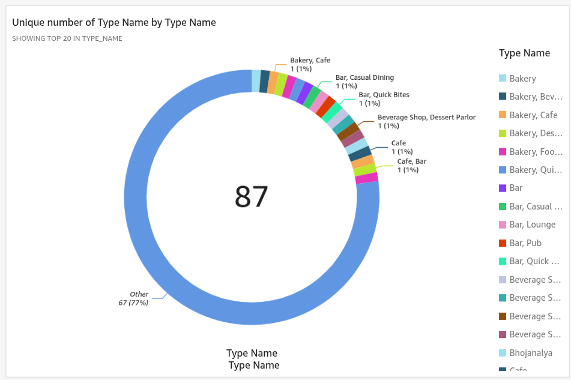
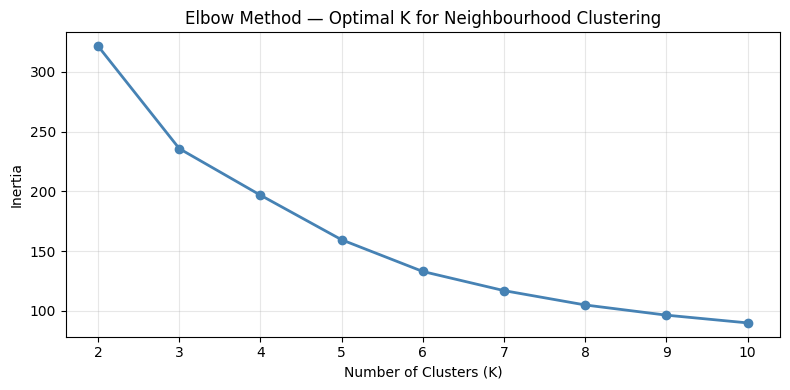
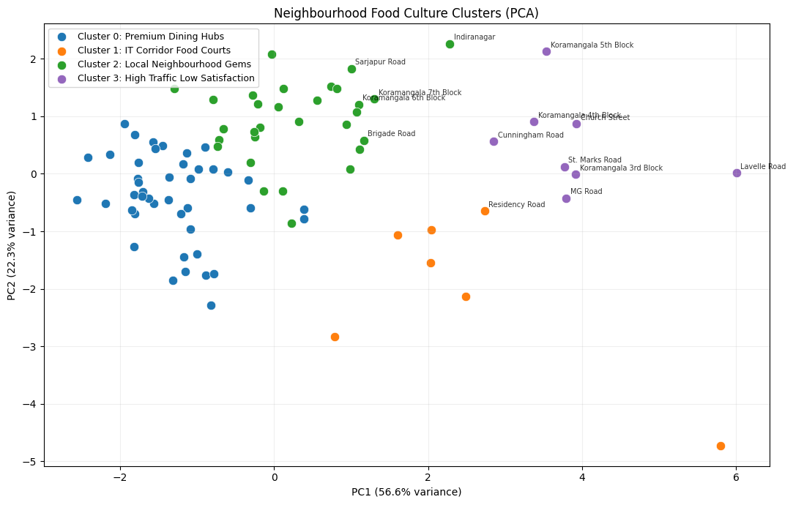

# Silicon Plate — Bengaluru Food Intelligence Platform

An end-to-end data engineering and analytics project built on **51,717 Zomato restaurant listings** across Bengaluru. Covers the full pipeline from raw data ingestion to a cloud BI dashboard, with an ML clustering layer on top.

---

## What This Project Does

Raw restaurant data is ingested, cleaned, modelled into a star schema, loaded into a cloud data warehouse, and analysed through an interactive BI dashboard. A separate ML layer clusters neighbourhoods by food culture patterns using K-Means.

**Questions answered:**
- Which neighbourhoods have the highest-rated restaurants?
- Does online ordering correlate with higher ratings or votes?
- Which cuisines dominate by popularity vs. quality?
- How does cost distribute across city zones?
- Are high-vote restaurants actually high-quality? *(spoiler: no)*
- Which neighbourhoods share food culture, regardless of geography?

---

## Architecture

```
Kaggle CSV
    ↓
Python ETL (pandas)       ← clean, transform, normalize
    ↓
Amazon S3                 ← data lake — raw + cleaned CSVs
    ↓
Amazon RDS (PostgreSQL)   ← data warehouse — star schema
    ↓
Amazon QuickSight         ← BI dashboard
    ↓
AWS SageMaker Studio      ← ML clustering notebook
```

---

## Data Model — Star Schema

```
                     ┌──────────────────┐
                     │  dim_restaurant  │
                     │ restaurant_id PK │
                     │ name, phone      │
                     └────────┬─────────┘
                              │
┌────────────────┐   ┌────────▼──────────────────────┐   ┌──────────────────┐
│  dim_location  │   │  fact_restaurant_performance   │   │   dim_cuisine    │
│ location_id PK ├───┤ restaurant_id FK               ├───┤ cuisine_id PK    │
│ neighbourhood  │   │ location_id FK                 │   │ cuisine_name     │
│ zone           │   │ cuisine_id FK                  │   │ cuisine_category │
└────────────────┘   │ rest_type_id FK                │   └──────────────────┘
                     │ rating, votes                  │
┌──────────────────┐ │ avg_cost_for_two               │
│  dim_rest_type   ├─┤ online_order_flag              │
│ rest_type_id PK  │ │ book_table_flag                │
│ type_name        │ └────────────────────────────────┘
└──────────────────┘
```

**Engineered column — `zone`:** ~100 raw neighbourhood names are mapped to 4 city zones (North / South / East / West) to enable city-wide aggregation — a new business dimension derived from raw data.

---

## ETL Pipeline

| Script | What it does |
|--------|-------------|
| `etl/01_extract.py` | Load raw CSV, inspect shape and nulls |
| `etl/02_transform.py` | Clean ratings, fix cost formatting, normalize booleans, engineer `zone` and `primary_cuisine` |
| `etl/03_load.py` | Populate dimension tables, resolve foreign keys, load fact table into RDS via SQLAlchemy |

```bash
# Install dependencies
uv sync

# Configure credentials
cp .env.example .env
# Edit .env — add RDS endpoint, password, and S3 bucket name

# Run pipeline
uv run python etl/01_extract.py
uv run python etl/02_transform.py
uv run python etl/03_load.py

# Apply schema to RDS
psql -h <rds-endpoint> -U postgres -d zomatodb -f sql/01_create_schema.sql
```

---

## SQL — Analytical Queries

Seven queries in `sql/03_analytical_queries.sql`:

| Query | Techniques used |
|-------|----------------|
| Top 10 neighbourhoods by avg rating | `JOIN`, `GROUP BY`, `HAVING` |
| Cuisine popularity vs quality ranking | `RANK()` window function |
| Online ordering impact | `CASE`, conditional aggregation |
| Cost quartile by zone | `NTILE()` window function |
| High votes, low rating (underperformers) | `PERCENTILE_CONT`, subquery |
| Restaurant type performance | CTE + `RANK()` |
| Zone-wise market gap analysis | `CROSS JOIN`, city-avg comparison |

---

## Dashboard — Amazon QuickSight

5 visuals with interactive filters on zone, restaurant type, and online order flag.

| Visual | Chart Type |
|--------|-----------|
| Avg Rating by Neighbourhood | Horizontal Bar |
| Cuisine Popularity vs Quality | Scatter Plot |
| Online Order Impact | KPI + Bar |
| Cost Distribution by Zone | Box Plot |
| Restaurant Type Volume | Donut Chart |







---

## ML — Neighbourhood Clustering

**Notebook:** [`notebooks/neighbourhood_clustering.ipynb`](notebooks/neighbourhood_clustering.ipynb)
**Trained on:** AWS SageMaker Studio

Groups Bengaluru's ~90 qualifying neighbourhoods by food culture using K-Means — not by pin on a map.

**Features per neighbourhood:** `avg_rating` · `avg_votes` · `avg_cost` · `pct_online_order` · `pct_book_table` · `cuisine_diversity`

**Process:** Aggregate from RDS via SQL → `StandardScaler` → Elbow method → `KMeans(K=4)` → PCA 2D visualization → Cluster profiling

| Cluster | Name | Profile |
|---------|------|---------|
| 0 | Premium Dining Hubs | High cost, high rating, high table booking % |
| 1 | IT Corridor Food Courts | High online orders, high volume, medium cost |
| 2 | Local Neighbourhood Gems | Low cost, decent rating, low votes |
| 3 | High Traffic Low Satisfaction | High votes, below-average rating |




**Key finding:** Geography doesn't predict food culture — socioeconomics does. Whitefield (East) and Koramangala (South) cluster together; both are high-income IT corridors with near-identical dining patterns despite being on opposite sides of the city.

---

## Key Insights

1. **Votes ≠ Quality** — The top 10% most-voted restaurants average *below* city mean rating. Popularity and satisfaction are not the same metric.
2. **South & East zones dominate** — Koramangala and Indiranagar lead on both restaurant density and average rating.
3. **Online ordering drives volume, not quality** — Restaurants with online ordering get ~40% more votes but marginally lower ratings.
4. **Socioeconomic clustering** — Neighbourhood food culture is shaped by income level, not map position.

---

## Project Structure

```
etl/                          Python ETL pipeline (extract → transform → load)
sql/                          Schema DDL + 7 analytical queries
notebooks/                    ML clustering notebook (SageMaker)
dashboard/screenshots/        QuickSight visuals + ML plots
data/raw/                     Original Kaggle CSV (gitignored)
data/cleaned/                 Transformed CSV uploaded to S3 (gitignored)
docs/                         RDS + S3 setup guide
```

---

## Stack

| Layer | Tool |
|-------|------|
| Data processing | Python, pandas |
| Cloud storage | Amazon S3 |
| Data warehouse | Amazon RDS (PostgreSQL) |
| BI / Dashboarding | Amazon QuickSight |
| ML | scikit-learn, matplotlib |
| ML compute | AWS SageMaker Studio |
| Dependency management | uv |
